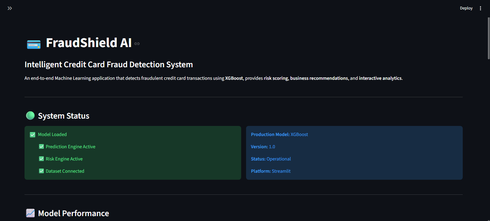
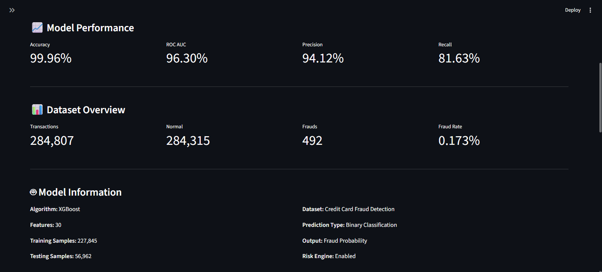
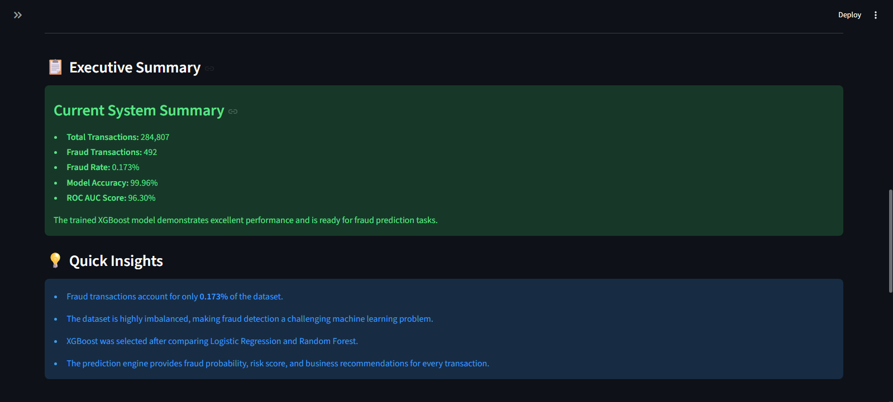
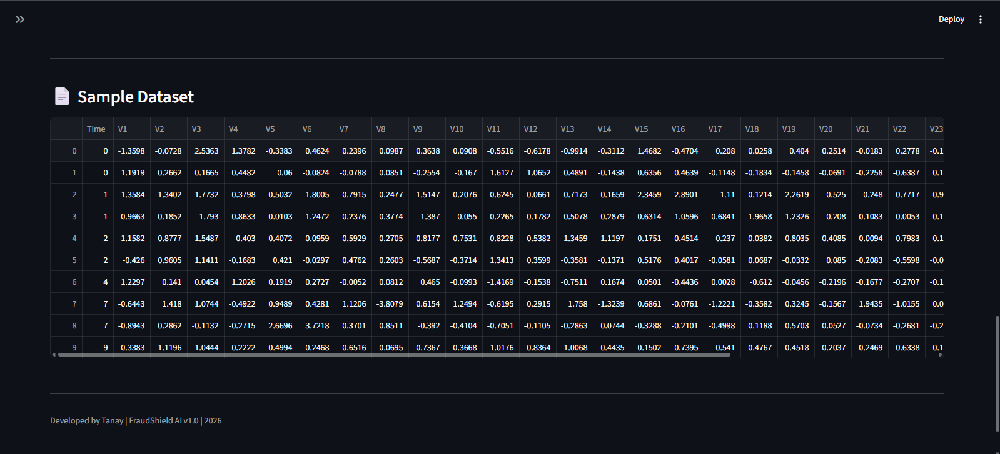
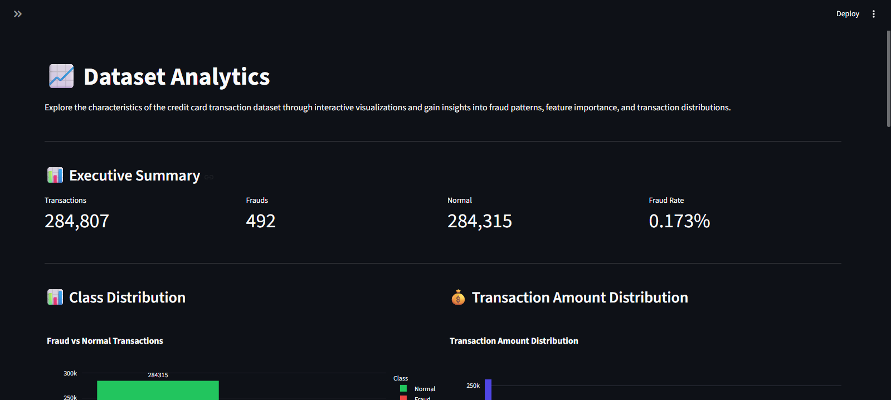
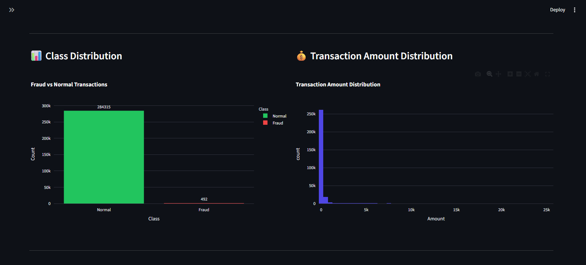
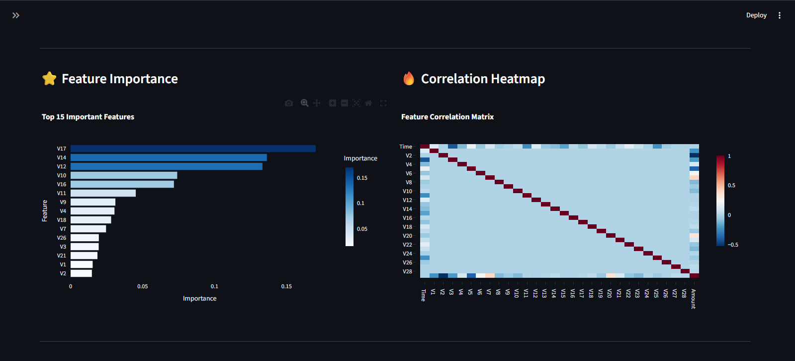

# 💳 FraudShield AI

## 🌐 Live Demo

https://YOUR-APP.streamlit.app

<div align="center">

### Intelligent Credit Card Fraud Detection & Risk Analysis System

An end-to-end Machine Learning application that detects fraudulent credit card transactions using **XGBoost**, provides **risk scoring**, **business recommendations**, and an **interactive Streamlit dashboard**.


</div>

---

# 📌 Project Overview

Credit card fraud is one of the biggest challenges faced by financial institutions. Every day, millions of transactions are processed, making it difficult to identify fraudulent activities manually.

**FraudShield AI** is an end-to-end Machine Learning application designed to detect potentially fraudulent credit card transactions using historical transaction data.

The project includes:

- Machine Learning model training
- Data preprocessing
- Model evaluation
- Interactive analytics
- Fraud prediction engine
- Risk scoring
- Business recommendations
- Streamlit web application

---

# 🎯 Problem Statement

Develop a machine learning solution capable of identifying fraudulent credit card transactions while minimizing false positives and providing meaningful insights for business users.

---

# ✨ Features

✅ Data Preprocessing

✅ Exploratory Data Analysis (EDA)

✅ Multiple Machine Learning Models

- Logistic Regression
- Random Forest
- XGBoost

✅ Automatic Model Selection

✅ Model Evaluation

- Accuracy
- Precision
- Recall
- ROC-AUC

✅ Fraud Prediction Engine

✅ Batch CSV Prediction

✅ Fraud Probability Estimation

✅ Risk Score Generation

✅ Business Recommendations

✅ Interactive Streamlit Dashboard

✅ Analytics Dashboard

✅ Model Insights

✅ Export Prediction Report (CSV)

---

# 🏗️ System Architecture

```text
                    Credit Card Dataset
                             │
                             ▼
                     Data Preprocessing
                             │
                             ▼
                    Feature Scaling
                             │
                             ▼
                     Train/Test Split
                             │
                             ▼
        Logistic Regression | Random Forest | XGBoost
                             │
                             ▼
                     Best Model Selected
                             │
                             ▼
                    Prediction Engine
                             │
                             ▼
      Fraud Probability + Risk Score + Recommendation
                             │
                             ▼
                  Streamlit Web Application
                             │
                             ▼
 Dashboard | Analytics | Prediction Center | Model Insights
```

---

# 📱 Application Pages

## 🏠 Dashboard

Provides a high-level overview of the system including:

- Model Performance
- Dataset Statistics
- System Status
- Executive Summary
- Model Information

---

## 📈 Analytics

Interactive visualizations including:

- Class Distribution
- Transaction Amount Distribution
- Feature Importance
- Correlation Heatmap
- Business Insights

---

## 🤖 Prediction Center

Allows users to:

- Upload CSV files
- Generate fraud predictions
- Calculate fraud probability
- Assign risk scores
- Generate recommendations
- Export prediction reports

---

## 📊 Model Insights

Displays model evaluation using:

- Performance Metrics
- Confusion Matrix
- ROC Curve
- Precision-Recall Curve
- Feature Importance
- Business Interpretation

---

# ⚙️ Tech Stack

| Category | Technologies |
|-----------|--------------|
| Programming Language | Python |
| Data Processing | Pandas, NumPy |
| Machine Learning | Scikit-learn, XGBoost |
| Visualization | Matplotlib, Plotly |
| Web Framework | Streamlit |
| Model Storage | Joblib |
| Version Control | Git & GitHub |

---

# 📂 Project Structure

```text
FraudShield-AI/
│
├── data/
│   └── creditcard.csv/
│       └── creditcard.csv
│
├── images/
│   ├── confusion_matrix.png
│   ├── roc_curve.png
│   ├── precision_recall_curve.png
│   ├── feature_importance.png
│
├── models/
│   ├── fraud_model.pkl
│   ├── time_scaler.pkl
│   └── amount_scaler.pkl
│
├── pages/
│   ├── 1_📊_Dashboard.py
│   ├── 2_📈_Analytics.py
│   ├── 3_🤖_Prediction_Center.py
│   └── 4_📈_Model_Insights.py
│
├── reports/
│   ├── feature_importance.csv
│   └── model_metrics.csv
│
├── src/
│   ├── preprocess.py
│   ├── train.py
│   ├── evaluate.py
│   ├── predict.py
│   └── utils.py
│
├── app.py
├── requirements.txt
├── README.md
└── .gitignore
```

---

# 🚀 Installation

Clone the repository

```bash
git clone https://github.com/YOUR_USERNAME/FraudShield-AI.git
```

Move into the project directory

```bash
cd FraudShield-AI
```

Install dependencies

```bash
pip install -r requirements.txt
```

Run the application

```bash
streamlit run app.py
```

---

# 📊 Model Performance

The final production model is **XGBoost**, selected after comparing multiple classification algorithms.

Evaluation Metrics:

- Accuracy
- Precision
- Recall
- ROC-AUC

Detailed evaluation results are available in the **Model Insights** page of the application.

---


# 📸 Application Screenshots

---

# 🏠 Dashboard

The Dashboard provides an overview of the fraud detection system, model performance, dataset statistics, and operational status.

<p align="center">


</p>

<p align="center">


</p>

---

# 📈 Analytics

The Analytics page helps visualize fraud patterns, feature importance, transaction distributions, and correlations within the dataset.

<p align="center">


</p>

<p align="center">

</p>

---

# 🤖 Prediction Center

The Prediction Center allows users to upload transaction datasets, generate fraud predictions, calculate fraud probabilities, assign risk levels, and export prediction reports.

<p align="center">


</p>

<p align="center">


</p>

---

# 📊 Model Insights

The Model Insights page presents evaluation metrics and visualizations generated during model validation.

<p align="center">


</p>

<p align="center">


</p>
---

# 📈 Workflow

```text
Credit Card Dataset
        │
        ▼
Data Cleaning & Preprocessing
        │
        ▼
Feature Scaling
        │
        ▼
Train/Test Split
        │
        ▼
Train Multiple ML Models
        │
        ▼
Select Best Model (XGBoost)
        │
        ▼
Model Evaluation
        │
        ▼
Save Model
        │
        ▼
Prediction Engine
        │
        ▼
Streamlit Dashboard
```

---

# 💡 Key Highlights

- Built a complete end-to-end Machine Learning pipeline.
- Compared multiple classification algorithms before selecting the final model.
- Designed an interactive Streamlit application with four dedicated modules.
- Implemented fraud probability estimation and business-focused risk analysis.
- Developed reusable preprocessing and prediction pipelines.
- Created an interactive dashboard for data exploration and model evaluation.

---

# ⚠️ Current Limitation

The dataset used in this project is anonymized.

Features **V1–V28** were generated using **Principal Component Analysis (PCA)** to preserve user privacy.

Because of this, the application requires data in the same format as the training dataset and cannot directly evaluate arbitrary real-world card transactions.

---

# 🔮 Future Improvements

- Real-time fraud detection
- API integration
- User authentication
- Explainable AI using SHAP
- Docker deployment
- Cloud deployment
- Monitoring dashboard
- Live transaction streaming

---

# 👨‍💻 Developer

**Tanay**

B.Tech Computer Science Engineering (Business Systems)

Interested in:

- Data Science
- Machine Learning
- Artificial Intelligence
- Backend Development

---

# ⭐ If you found this project useful, consider giving it a star!
